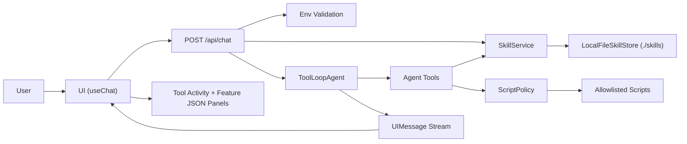

# Skill Engine

A Next.js demo that runs a tool-enabled AI agent with runtime skills from the local filesystem.

## What It Demonstrates

- Progressive skill loading (`name`/`description` first, full `SKILL.md` on demand)
- AI SDK `ToolLoopAgent` + `createAgentUIStreamResponse`
- Guided workflow chat UI built with AI Elements + shadcn/base-nova primitives
- Structured PRD + validated feature set JSON output
- Strict allowlisted script execution (`score-features`, `validate-feature-set`)

## Skill Location

Skills are read from `./skills`.

```txt
skills/
  product-feature-strategist/
    SKILL.md
    references/*.md
```

## Environment

Copy `.env.example` to `.env.local` and set values.

```bash
cp .env.example .env.local
```

Required:

- `AI_GATEWAY_API_KEY`

## Run

```bash
pnpm install
pnpm dev
```

Open [http://localhost:3000](http://localhost:3000).

## API

`POST /api/chat`

Request body:

```json
{
  "messages": [],
  "context": {
    "productType": "SaaS",
    "audience": "Product teams",
    "constraints": ["8-week MVP"],
    "successMetric": "Weekly active teams"
  }
}
```

The route streams AI SDK UIMessage chunks compatible with `useChat`.

## Architecture

### High-level design

- **Frontend** (`app/page.tsx`, `components/chat/*`):
  - Guided product brief inputs.
  - Streaming chat UI via `useChat`.
  - Tool activity panel and extracted feature JSON panel.
- **API route** (`app/api/chat/route.ts`):
  - Validates request shape.
  - Loads runtime resources (env, skill service, script policy, agent).
  - Streams responses through `createAgentUIStreamResponse`.
- **Agent core** (`lib/agent/*`):
  - `ToolLoopAgent` with runtime `callOptionsSchema`.
  - System prompt assembly from skills metadata + request context.
  - Tool definitions for skill loading, script execution, and final feature-set emit.
- **Skills layer** (`lib/skills/*`, `skills/*`):
  - Local filesystem skill discovery.
  - Frontmatter parsing and markdown body extraction.
  - Cached metadata/skill/reference access through `SkillService`.
- **Script safety layer** (`lib/security/script-policy.ts`, `scripts/*`):
  - Allowlisted script IDs only.
  - Script ID -> fixed command mapping.
  - JSON input via stdin, structured output via stdout.

### Runtime graph



### Data contracts

- **Chat request**:
  - `messages`: UIMessage array from AI SDK UI.
  - `context`:
    - `productType?: string`
    - `audience?: string`
    - `constraints?: string[]`
    - `successMetric?: string`
- **Feature set output** (validated):
  - `selected`: list of `{ featureId, title, priority, rationale, dependencies }`
  - `deferred`: list of `{ featureId, reason }`

### Tooling model

The agent can call four tools:

1. `loadSkill(name)`:
   - Loads full `SKILL.md` body for one skill.
2. `loadSkillReferences(name)`:
   - Loads `references/*.md` for the selected skill.
3. `runAllowlistedScript({ scriptId, input })`:
   - Runs one of:
     - `score-features`
     - `validate-feature-set`
4. `emitFeatureSet(featureSet)`:
   - Validates and persists final feature-set payload for UI consumption.

## Workflow

### End-to-end request lifecycle

1. User fills guided fields and submits a problem statement.
2. Frontend sends `messages + context` to `/api/chat`.
3. API validates:
   - environment (`AI_GATEWAY_API_KEY`, etc.)
   - request body shape
4. API discovers available skills (metadata only: `name`, `description`).
5. Agent starts with system prompt containing:
   - task instructions
   - request context
   - available skills list
6. Agent chooses relevant skill and calls:
   - `loadSkill`
   - `loadSkillReferences`
7. Agent drafts PRD + feature candidates.
8. Agent may call `runAllowlistedScript` to:
   - rank candidates (`score-features`)
   - validate JSON shape (`validate-feature-set`)
9. Agent calls `emitFeatureSet` with final feature set.
10. Agent streams final markdown response + tool traces to UI.
11. UI renders:
    - conversational output
    - tool status timeline
    - JSON panel populated from emitted feature-set output.

### Progressive disclosure behavior

- Startup/request bootstrap includes only skill metadata.
- Full skill instructions and references are loaded only when requested by the agent.
- This keeps token usage tighter while preserving rich context when needed.

### Failure behavior

- Invalid request shape: HTTP `400`.
- Runtime/env issues (e.g., missing API key): HTTP `500` with JSON error body.
- Tool failures are surfaced in tool output/error states in the conversation stream.
- Script execution is hard-failed when script ID is not allowlisted.

## Configuration

See `.env.example`:

- `AI_GATEWAY_API_KEY` (required)
- `SKILL_ENGINE_MODEL` (default: `openai/gpt-5.2-chat`)
- `SKILLS_ROOT_DIR` (default: `skills`)
- `AGENT_ALLOWED_SCRIPTS` (default: `score-features,validate-feature-set`)
- `SKILLS_CACHE_TTL_MS` (default: `30000`)

## Project map

- `app/api/chat/route.ts`: streaming chat endpoint.
- `components/chat/chat-workflow.tsx`: guided chat UX and transport.
- `lib/agent/*`: agent schemas, prompts, tools, and factory.
- `lib/skills/*`: skill parsing, storage, and caching service.
- `lib/security/script-policy.ts`: allowlisted script execution.
- `scripts/*`: deterministic helper scripts.
- `skills/*`: local skill content.
